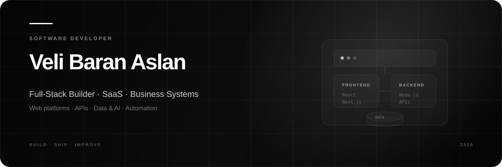

<p align="center">\n  \n</p>\n\n<p align="center"><strong>Software Developer</strong> · Full-Stack · SaaS · Business Systems</p>\n<p align="center">Building software around real businesses, real workflows and real operational problems.</p>\n\n<p align="center">\n  <a href="https://github.com/BaranAsln0734"></a>\n  <a href="https://www.linkedin.com/"></a>\n</p>\n\n<br>\n\n## ✦ The Work\n\nI build **full-stack products and business systems** that turn manual processes into software.\n\nMy work spans product architecture, frontend systems, backend APIs, databases, automation, analytics and machine learning.\n\n> **The goal isn’t to write more code.**\n>\n> **The goal is to build a system that makes the business work better.**\n\n---\n\n## ◇ What I Build\n\n<table>\n<tr><td width="50%" valign="top"><h3>SaaS & Business Systems</h3>CRM · Service Management · Work Orders · Dashboards · Reporting · Multi-client Platforms</td><td width="50%" valign="top"><h3>Full-Stack Products</h3>React · Next.js · TypeScript · Node.js · Express · REST APIs · PostgreSQL</td></tr>\n<tr><td width="50%" valign="top"><h3>Data & AI</h3>Python · Pandas · Scikit-learn · XGBoost · SHAP · FastAPI · Streamlit</td><td width="50%" valign="top"><h3>Automation & Infrastructure</h3>Business automation · Integrations · SEO tooling · Linux · VPS · Docker · CI/CD</td></tr>\n</table>\n\n---\n\n## ⚡ Selected Work\n\n### 01 · CVSPower\n**Full-stack service & business management platform**\nDesigned around real generator/service-company workflows.\nReact · TypeScript · Express · PostgreSQL · SQLite · Capacitor\nCustomer management · service tracking · work orders · PDFs · QR systems · maps · authentication · mobile support\n\n### 02 · Business Platforms\n**Production-oriented web platforms for real companies**\nA collection of systems built for energy, electrical, HVAC, automotive and industrial businesses.\nNext.js · React · TypeScript · Tailwind · PostgreSQL · Supabase\nCvsPower · Akan Enerji · Delfin Elektrik · KlimaServis · Erden Konveyör · OtoServis · Acil Jeneratör Servisi · Lidersan Elektrik\n\n### 03 · Vertical SaaS Concepts\n**Reusable software for service-based industries**\nThe recurring pattern behind my projects:\n```text\nCustomer → Request → Service / Work Order → Operation → Documents → Reporting\n```\nThe long-term direction is turning these patterns into **reusable vertical SaaS products**.\n\n### 04 · Customer Churn Prediction\n**End-to-end machine learning product**\nData preparation · feature engineering · model comparison · class balancing · explainability · API · dashboard · business impact simulation\nPython · Pandas · Scikit-learn · XGBoost · SHAP · FastAPI · Streamlit\n\n### 05 · Apartment Management\n**Full-stack building management platform**\nReact · Vite · TypeScript · Tailwind · Express · Prisma\nDesigned around residents, management workflows, data and operational visibility.\n\n---\n\n## ◈ Technology\n\n**Core** — TypeScript · JavaScript · Python · SQL\n\n**Frontend** — React · Next.js · Vite · Tailwind CSS · Framer Motion\n\n**Backend** — Node.js · Express · FastAPI · REST APIs\n\n**Data** — PostgreSQL · SQLite · Prisma · Supabase\n\n**AI / ML** — Pandas · NumPy · Scikit-learn · XGBoost · SHAP · Streamlit\n\n**Infrastructure** — Linux · Ubuntu · Docker · Git · GitHub Actions\n\n---\n\n## ⟡ How I Think About Engineering\n\nI like working from the **business problem backwards**.\n\n<p align="center"><strong>Problem → Product → Architecture → System → Automation → Deploy → Measure → Improve</strong></p>\n\nI prefer **complete systems over isolated features** — software that can be deployed, used, measured and improved.\n\n---\n\n## ◉ Current Direction\n\n- **Vertical SaaS architecture**\n- **Multi-client business platforms**\n- **AI-powered business applications**\n- **Predictive analytics & data products**\n- **Automation systems**\n- **Developer tooling**\n- **Production web applications**\n- **Linux / VPS infrastructure**\n\n---\n\n## GitHub / Selected Signals\n\n<p align="center">\n  \n  \n</p>\n\n<p align="center"></p>\n\n---\n\n## ◇ Private by Design\n\nA significant part of my work is private because it involves **real businesses, active products and client-specific systems**.\n\nThat means this profile doesn’t represent everything I build.\n\nThe public repositories are a **small window into a much larger body of work**.\n\n---\n\n<p align="center"><strong>BUILD · SHIP · IMPROVE</strong><br><br><sub>Software · SaaS · Systems · Data · AI</sub></p>